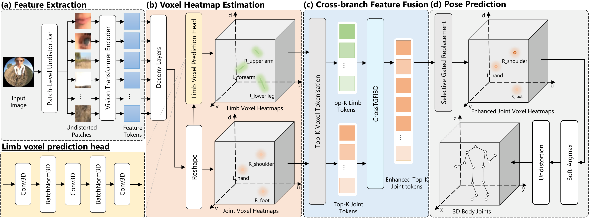
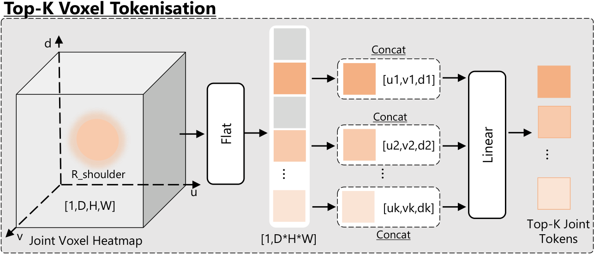
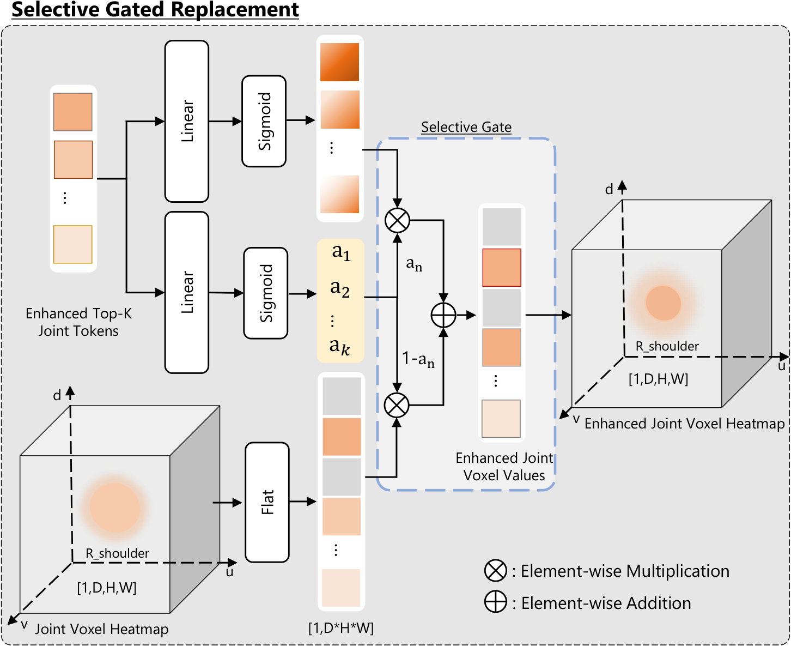
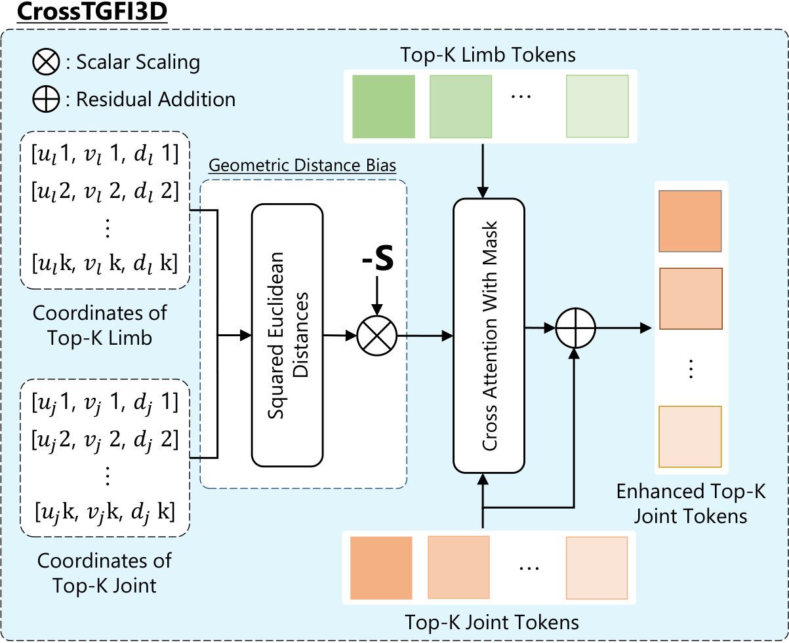

#Structure-Aware Joint-Limb Voxel Modelling for Egocentric 3D Human Pose Estimation

## 1. Overview
This repository provides the implementation of **Structure-Aware Joint-Limb Voxel Modelling for Egocentric 3D Human Pose Estimation**.

Existing voxel-based egocentric pose estimation methods can reduce monocular depth ambiguity, but they usually predict joint voxel heatmaps independently and lack explicit modelling of joint--limb structural dependencies in 3D space. Directly modelling such interactions over dense voxel grids is also computationally expensive.

To address this problem, we propose a structure-aware voxel framework that jointly models discrete body joints and continuous limb segments. The method introduces an auxiliary limb voxel branch for bone-level structural supervision, and further uses sparse Top-K voxel tokenisation with CrossTGFI3D to efficiently fuse joint and limb information under topology and geometry constraints.
<p align="center">
  
</p>

## 2. Key Algorithms

### Joint--Limb Voxel Modelling

The framework predicts both joint voxel heatmaps and limb voxel heatmaps. The joint branch localises discrete body keypoints, while the auxiliary limb branch models continuous limb segments in 3D space. This design provides bone-level structural supervision and helps the network preserve anatomically consistent poses.

### Sparse Top-K Voxel Tokenisation

Directly modelling interactions over the full 3D voxel grid is computationally expensive. To address this, the method selects only the Top-K highest-response voxels from each joint and limb heatmap. These selected voxels are converted into compact tokens using their response values and 3D coordinates, enabling efficient structural reasoning over informative regions.
<p align="center">
  
</p>

<p align="center">
  
</p>

### CrossTGFI3D: Geometry-aware Joint--Limb Fusion

CrossTGFI3D performs cross-branch attention between joint tokens and limb tokens. It uses a geometry-aware distance bias to encourage interactions between spatially close regions and a topology-guided mask to restrict attention to anatomically valid joint--limb connections. The enhanced joint tokens are then written back to the joint heatmaps for final 3D pose prediction.

<p align="center">
  
</p>

The implementations of the above three components can be found in:

```text
mmpose/models/egocentric/feature_mix_only_end2_limb_heatmap_3d_net_topk_crossattention_v2.py
```

## 3. Installation

 We recommend creating an isolated conda environment before installing the required packages.

### Create a conda environment

```bash
conda create -n joint_limb_pose python=3.9 -y
conda activate joint_limb_pose
```

### Install PyTorch

Install the PyTorch version that matches your CUDA environment. For example, the experiments in this project were conducted with PyTorch 1.10.1 and CUDA 11.1.

```bash
conda install pytorch==1.13.1 torchvision==0.14.1 torchaudio==0.13.1 pytorch-cuda=11.7 -c pytorch -c nvidia
```

### Install MMCV and MMPose-related dependencies

```bash
pip install openmim
mim install mmcv-full==1.7.1
pip install -e .
```

### Install additional dependencies

```bash
pip install -r requirements.txt
```

If smplx installed open3d-python, you should uninstall it by running:

```bash
pip uninstall open3d-python
```

## 4. Dataset Preparation

This project uses the following publicly available egocentric pose estimation datasets.

### EgoWholeBody Training Dataset

The EgoWholeBody training dataset can be downloaded from the official Edmond repository:

https://edmond.mpg.de/dataset.xhtml?persistentId=doi:10.17617/3.SJYBX3

### EgoWholeBody Test Dataset

The EgoWholeBody test dataset can be downloaded from the official Edmond repository:

https://edmond.mpg.de/dataset.xhtml?persistentId=doi:10.17617/3.FSBR5V

### SceneEgo Dataset

The SceneEgo dataset can be downloaded from the official Edmond repository:

https://edmond.mpg.de/dataset.xhtml?persistentId=doi:10.17617/3.VCIHDO

After downloading the datasets, unzip all of the files. please organise them as follows:

```text
data/
├── EgoWholeMocap/
│   ├── train/
│   │   ├── path to dataset_dir
│   │   │   ├── renderpeople_adanna
│   │   │   ├── renderpeople_amit
│   │   │   ├── ......
│   │   │   ├── renderpeople_mixamo_labels_old.pkl
│   │   │   └── ......
│   │   └── ......
│   └── test/
│       └──render_people_mixamo_test_seq
│          ├── render_people_manuel
│          ├── ......
│          └── renderpeople_mixamo_labels_test_seq.pkl
│ 
└── SceneEgo/
    ├── train/
    │   ├── diogo1
    │   ├── ......
    │   └── pranay2
    └── test/
        ├── diogo1
        ├── ......
        └── jian2
```

After downloading and organising the datasets, please update the dataset paths in the corresponding files under `mmpose/datasets/datasets/egocentric/`.

For SceneEgo, please modify the dataset paths in the following files:

- SceneEgo training set: `mocap_studio_finetune_dataset_limb.py`
- SceneEgo test set: `mocap_studio_dataset.py`, `mocap_studio_dataset_limb.py`

### Ground-Truth Limb Heatmap Generation

The proposed joint--limb dual-branch model requires ground-truth limb voxel heatmaps for training. However, public egocentric datasets such as EgoWholeBody and SceneEgo only provide 3D joint annotations and do not include limb heatmap labels.

Therefore, we generate the ground-truth limb voxel heatmaps from the existing 3D joint annotations during data loading. For each predefined limb connection, the two endpoint joints are mapped into the 64×64×64 voxel space, and a continuous limb heatmap is generated by sampling points along the bone segment and applying 3D Gaussian responses.

This process does not require any additional annotations or external data. The generated limb heatmaps are used as the supervision target for the auxiliary limb branch.

The implementation is provided in ```mmpose/datasets/datasets/egocentric/renderpeople_mixamo_dataset_limb.py``` , ```mocap_studio_finetune_dataset_limb.py``` and `mocap_studio_dataset_limb.py`.

### Pretrained Weights

Before training or evaluation, please download the pretrained weights used for model initialisation. This project uses two pretrained weight files: the ViT backbone weights and the skeleton voxel heatmap predictor weights.

- **ViT backbone weights**: used to initialise the fisheye image feature extraction backbone.
- **Skeleton voxel heatmap predictor weights**: used to initialise the joint voxel heatmap prediction branch.

[Download model weights](https://drive.google.com/drive/folders/17EOAVadp5JWLRinj-Vw0NsE99yLG1QNP?usp=sharing) and put it under ```./pretrained_models/ ```

## 5. Training

### 1.Train the pose estimation model on EgoWholeBody Training Dataset


Before training, please update the required file paths in the following configuration file: ```configs/egofullbody/fisheye_vit/heatmap_3d_limb.py```

Please check and modify the paths around the following lines according to your local environment:```line 1, line 3, line 22, line 31, line 33, line 54, line 177, line 178```

Then, make sure that the `keypoint_head` is set to:

```python
type='TopKCrossattenyionHeatmap3DNet_v2'
```

#### Single-GPU training

Run the following command from the root directory of this repository:

```bash
bash tools/python_train.sh configs/egofullbody/fisheye_vit/heatmap_3d_limb.py --gpu-id 1 
```

#### Multi-GPU training

For multi-GPU training, use `tools/dist_train.sh`. The following example uses 2 GPUs:

```bash
bash tools/dist_train.sh configs/egofullbody/fisheye_vit/heatmap_3d_limb.py 2 
```

#### Note

The number of selected Top-K voxels can be adjusted in the configuration file by modifying:

```python
k_joint = 30
k_limb = 30
```

Changing `k_joint` and `k_limb` allows training and evaluating the model under different Top-K settings.

### 2.Train the pose estimation model on SceneEgo Dataset

Before training, please update the required file paths in the following configuration file: ```configs/egofullbody/fisheye_vit/heatmap_3d_finetune_limb.py```

Please check and modify the paths around the following lines according to your local environment:```line 1, line 3, line 25, line 34, line 35, line 56 ```

Then, make sure that the `keypoint_head` is set to:

```python
type='TopKCrossattenyionHeatmap3DNet_v2'
```

#### Single-GPU training

Run the following command from the root directory of this repository:

```bash
bash tools/python_train.sh configs/egofullbody/fisheye_vit/heatmap_3d_finetune_limb.py --gpu-id 0 
```

#### Note

The number of selected Top-K voxels can be adjusted in the configuration file by modifying:

```python
k_joint = 30
k_limb = 30
```

Changing `k_joint` and `k_limb` allows training and evaluating the model under different Top-K settings.

## 6. Evaluation

Before evaluation, please update the required file paths in the following configuration file: ``` configs/egofullbody/fisheye_vit/heatmap_3d_limb.py ```

Please check and modify the paths around the following lines according to your local environment: ```line 1, line 4, line 30, line 187, line 188 ```

### Select the test dataset

The test dataset should be specified in the `test` field of the configuration file. Please choose **one** of the following settings depending on the dataset to be evaluated.

#### EgoWholeBody test set

To evaluate on the EgoWholeBody test dataset, use the following setting:

```python
# test on EgoWholeBody test datafile
test = dict(
    type='RenderpeopleMixamoTestDataset',
    ann_file='path/to/EgoWholeMocap/test/render_people_mixamo_test_seq/renderpeople_mixamo_labels_test_seq.pkl',
    img_prefix='path/to/EgoWholeMocap/test/render_people_mixamo_test_seq',
    data_cfg=data_cfg,
    pipeline=test_pipeline,
    # part_dataset=None,
)
```

#### SceneEgo test set

To evaluate on the SceneEgo test dataset, use the following setting:

```python
# test on SceneEgo test datafile
test = dict(
    type='MocapStudioDataset',
    data_cfg=data_cfg,
    pipeline=test_pipeline,
    # part_dataset=None,
)
```

### Run evaluation

After selecting the test dataset and updating the corresponding paths, run the following command from the root directory of this repository:

```bash
bash tools/python_test.sh configs/egofullbody/fisheye_vit/heatmap_3d_limb.py /path/to/epoch.pth --gpu-id 0
```

This command evaluates the trained model checkpoint and reports the pose estimation results on the selected test dataset.

## 7. Citation

If you find this repository useful for your research, please cite our paper:

```bibtex
@article{he2026structure,
  title={Structure-Aware Joint-Limb Voxel Modelling for Egocentric 3D Human Pose Estimation},
  author={He, Yinghao and Leow, Chee Siang and Nishizaki, Hiromitsu},
  journal={The Visual Computer},
  note={Manuscript submitted}
}

